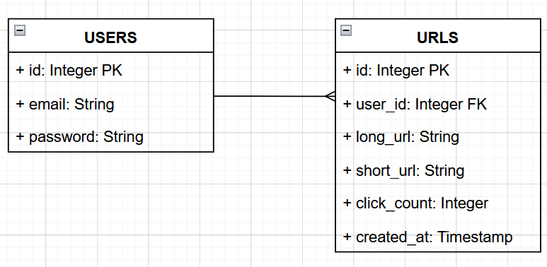
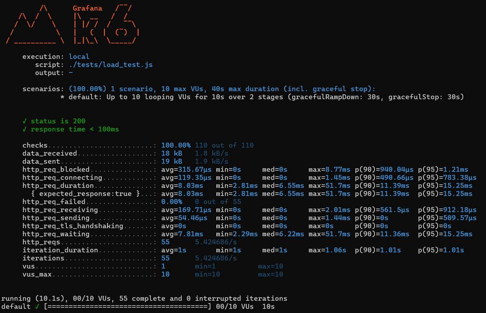

# UrlShortener

UrlShortener is a PERN (PostgreSQL, Express, React, Node.js) Full-Stack Web Appplication which allows users to easily shorten long URLs and access them via a short, unique URL. Additionally, the application provides analytics for each shortened URL, including the number of times the URL has been accessed.

Date: 23rd February 2024

Here's a quick demo on the features of the app and how the app works:

https://github.com/user-attachments/assets/5a18540d-34e2-458b-85c3-a068300c6876

## Usage
Pre-requisites (please ensure you have the following installed):
- Node.js
- PostgreSQL and pgAdmin
- k6 (for load testing)

Run the Application:
```bash
npm run start # run the program, installs libraries and starts front and backend
k6 run ./tests/load_test.js # run load tests (update JWT token in the script when necessary)
```

## Architecture
#### The Database
Based on the requirements, I first thought about the database and quickly came up with the following schema.


#### The Backend
After connecting the front and backend with a proxy, I initialized the database with pgAdmin and started working on the rough frontend. Then, for the backend, there are routes to access (access the long link via short link, which the frontend uses to redirect), get (get all links) and shorten (given a url, and a signed in user, it returns a shortened url). 

I also implemented JWT Authentication as I thought it is crucial for any site with users. This was implemented with bcrypt to store the hashed passwords in the database and jwt to authenticate users.

Why JWT?
- Stateless (easily authenticate user, without relying on server-side sessions)
- Scalable (using cookies rather than session storage, server can independently verify the user)
- Expiration and Refresh Tokens (I've implemented a refresh token system, where the user can refresh their token without logging in again)

The JWT Authentication was implemented as a middleware and on routes such as /api/shorten and not on /api/all and /api/access. This is because the user does not need to be authenticated to access the shortened links or get all the links. However, the user needs to be authenticated to shorten a link so that we can draw a one-to-many relation with the URLs table as a user.

Some considerations:
- Used pgAdmin to manage the database
- Used Postman to test the backend before connecting it to the frontend
- Database is initialised automatically within ./server/index.js
- Preferring async/await for readability
- Wrapping calls to the database in try/catch
- Reducing calls to the database by using a single query to get all the links (when generating new link)
- Attempted to handle all possible scenarios/cases where errors could occur
- Environmental Variables were used, so cross-env was used in the package.json file to ensure that the environment variables are set correctly in all environments (ideally the actual secrets shouldn't be there but I couldn't find a work around such that it works with a single command)
- Files are organized into the type of API eg. /auth for authentication, /shorten for working with the links

#### The Frontend
As with the front-end, I used Tailwind CSS and SCSS as my preferred CSS frameworks. I used Axios to handle requests to the backend and React Router to handle routing.

Some considerations:
- Used React Contexts to handle global state (user authentication, modals etc)
- Used React Router to handle routing
- Used Axios to handle requests to the backend
- I also handled error handling as well though minimally (more detailed errors could be better).
- Separated files into respective folders and components for reusabilitiy
- NOT FOUND page for 404 errors

#### The Load Testing
I used K6 to run load tests on the backend. I created a script at `./tests/load_test.js` that sends 100 requests to the /api/shorten endpoint, which I was able to run with all requests successful. However, I wasn't able to run the full 500,000 URL shortening requests at the same time scenario on my laptop.



#### Potential Improvements
- Caching frequently requested shortened URls to reduce load on backend with Redis to reduce load on database and improve performance
- Dockerize the application and use Kubernetes with Horizontal Pod Autoscaling and Load Balancers for scaling the application which would add more pods during high periods of traffic, use the load_test.js script to test the application with 500,000 URL shortening requests
- Implement a CI/CD pipeline with Github Actions to automate the deployment process (which could also have the load_test.js script run to check if application works as expected)
- More extensively test if errors could possibly occur and handle them, especially with edge cases
- Implement mobile optimisation and a more detailed error handling system with more descriptive error messages
- Use lazy loading and code splitting in the frontend to improve initial load times
- Use Joi to validate API input and prevent SQL  injection and XSS attacks

## Contact
Jolene - [jolenechong7@gmail.com](mailto:jolenechong7@gmail.com) <br>